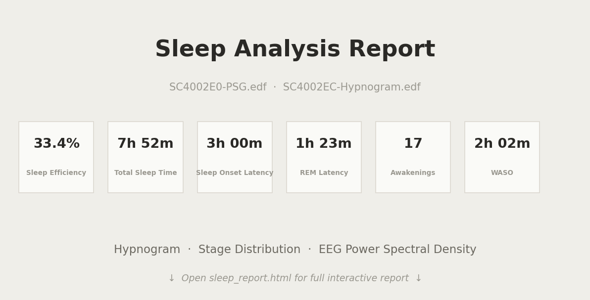

# Sleep Report Generator

讀取 [Sleep-EDF](https://physionet.org/content/sleep-edfx/) 的 PSG 與 Hypnogram EDF 檔案，自動產生一份 HTML 睡眠分析報告。

## 報告內容

1. **Hypnogram** — 時間 vs 睡眠階段圖
2. **睡眠階段佔比** — 甜甜圈圖 + 表格
3. **Sleep Efficiency（睡眠效率）**
4. **Sleep Onset Latency（入睡潛伏期）**
5. **REM Latency（REM 潛伏期）**
6. **覺醒次數與 WASO**
7. **各階段 EEG 功率頻譜圖**（Welch method, Fpz-Cz channel）

## 安裝

```bash
pip install -r requirements.txt
```

## 取得資料

將 EDF 檔放在 `data/` 目錄下：

```bash
mkdir -p data
# 從 PhysioNet 下載，或透過 MNE 內建下載：
python3 -c "
import mne
mne.datasets.sleep_physionet.age.fetch_data(subjects=[0], recording=[2], path='data/physionet')
"
cp data/physionet/physionet-sleep-data/SC4002E0-PSG.edf data/
cp data/physionet/physionet-sleep-data/SC4002EC-Hypnogram.edf data/
```

## 執行

```bash
# 使用預設路徑 (data/SC4002E0-PSG.edf + data/SC4002EC-Hypnogram.edf)
python3 sleep_report.py

# 自訂路徑
python3 sleep_report.py path/to/PSG.edf path/to/Hypnogram.edf output.html
```

產出的 `sleep_report.html` 可直接用瀏覽器開啟。

## 報告預覽



## 技術細節

- **MNE-Python** 讀取 EDF 與 annotation
- **Matplotlib** 產生圖表（Hypnogram、Donut chart、Bar chart、PSD）
- 圖表以 base64 嵌入 HTML，報告為單一自含檔案，無外部依賴
- 睡眠分期依 AASM 標準合併（S3 + S4 → N3）
- PSD 使用 Welch's method，視窗 4 秒、重疊 2 秒
